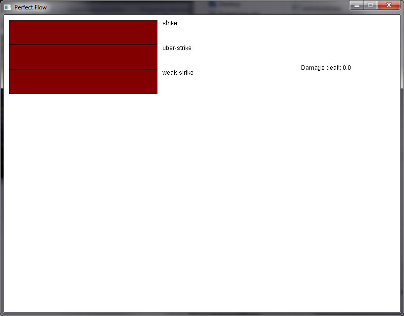

# To do / roadmap

## Improve rendering

 - font rendering is a bit yucky; see image:
    
 - display castable skills as icons instead of bars
 - display cooldowns on skill icon/bar
 - display keybind on skill icon/bar
 - display min/max/current on resource bars

### Minor cosmetic fixes

 - different colors for resource bars
 - make/find an icon for the executable / main window

## Installation / cross-platform / usability

 - Stop hardcoding font to load (probably bundle a font instead)
 - create installer (using self-extract?)
 - allow startup without commandline arguments, prompt user for level to load
 - DONE! configuration / user settings
    - DONE! custom key binds
        - DONE! additional layer of abstraction over key binds?
          - instead of key -> cast: skill, do key -> cast skill #x and assign each usable skill a generic index
          - Hey look, another use-case for the fancy EntityIndex store!
 
## Not feature creep I swear

 - implement more Actions
 - add channeling system (mostly just needs OnChannelTick info)
 - add modifier system; rewrite damage, cost etc. calculations to look through modifiers